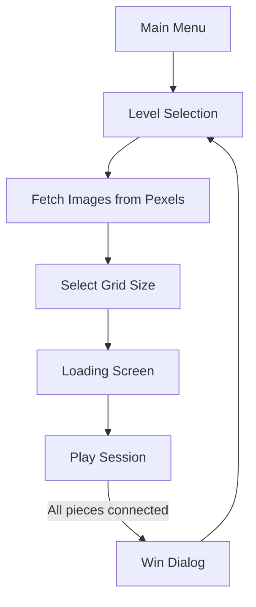
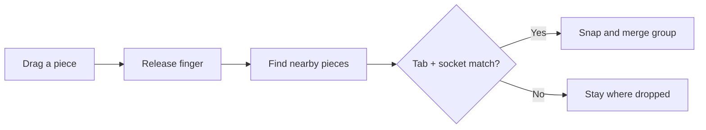

# Real Puzzle — Flutter Jigsaw Puzzle Game

A cross-platform jigsaw puzzle game built with **Flutter** and the **Flame** game engine. Pick a photo, choose how hard you want it, then drag and snap pieces together until the picture is complete.

---

## What is this app?

**Real Puzzle** is a digital jigsaw puzzle. Instead of a fixed set of images, it pulls beautiful photos from [Pexels](https://www.pexels.com). Each puzzle is cut into real-looking interlocking pieces — with bumps (tabs) and holes (sockets) — not plain squares.

You can play on **Android, iOS, and Web**. The app is locked to **landscape mode** for a wider puzzle board.

---

## How to play (user flow)

1. **Main Menu** — Tap **Play** or open **Settings**.
2. **Pick a photo** — Browse a scrollable grid of curated Pexels images.
3. **Choose difficulty** — Tap a photo, then pick a grid size (4 to 100 pieces).
4. **Loading** — The full-size image downloads in the background.
5. **Play** — Tap pieces from the bottom tray to place them on the board. Drag pieces to snap them together.
6. **Win** — When every piece is connected, you see a Lottie animation and your completion time.



---

## Key features

| Feature | What it means |
|--------|----------------|
| **Procedural pieces** | Every puzzle gets unique tab/socket shapes — like a real cardboard puzzle. |
| **Flexible difficulty** | Grid sizes from 2×2 (4 pieces) up to 10×10 (100 pieces). |
| **Piece grouping** | When two pieces snap together, they move as one group. |
| **Online images** | Photos are fetched live from the Pexels API. |
| **Hints** | 3 free hints show a faded ghost of the full image for 3 seconds. |
| **Zoom & pan** | Pinch and drag the board while playing. |
| **Sound effects** | Snap and win sounds (can be muted in settings). |

---

## Tech stack

| Category | Package | Used for |
|----------|---------|----------|
| **UI framework** | Flutter | Screens, menus, dialogs |
| **Game engine** | Flame | Piece rendering, drag-and-drop, collisions |
| **State** | Provider | Settings (sound, player name) |
| **Navigation** | GoRouter | Routes between screens |
| **Networking** | Dio | Pexels API calls |
| **Images** | cached_network_image | Caching downloaded photos |
| **Storage** | shared_preferences | Saving user settings |
| **Animations** | Lottie | Win celebration |
| **Audio** | audioplayers + flame_audio | Background music and SFX |

---

## Project structure (top to bottom)

Think of the app in four layers: **startup → menus → game setup → gameplay**.

### 1. App startup — `lib/main.dart`

This is where everything begins.

- Loads environment variables (Pexels API key from `.env`)
- Forces **landscape** orientation
- Sets up **Provider** (settings, audio, colors)
- Defines all **routes** with GoRouter

**Routes:**

| Path | Screen |
|------|--------|
| `/` | Main menu |
| `/play` | Level selection (photo grid) |
| `/play/loading` | Image download screen |
| `/play/session` | The actual puzzle game |
| `/settings` | Settings |
| `/settings/about` | About page |

### 2. Menus & selection

| Folder / file | Role |
|---------------|------|
| `lib/src/main_menu/` | Home screen with Play and Settings buttons |
| `lib/src/level_selection/` | Infinite-scroll photo grid from Pexels |
| `lib/src/level_selection/jigsaw_info.dart` | Data model for one puzzle (image URL, title, grid size) |
| `lib/src/level_selection/jigsaw_grid_item.dart` | One thumbnail in the grid |
| `lib/src/loading_selection/` | Shows progress while the full image loads |

**Level selection** calls the Pexels curated photos API (`/v1/curated`) with pagination (15 photos per page). When you tap a photo, a dialog lets you pick grid size: 2, 4, 5, 6, 7, 8, 9, or 10 (which means 4 to 100 pieces).

### 3. Gameplay — `lib/src/play_session/`

This is the heart of the app.

| File | Role |
|------|------|
| `play_session_screen.dart` | Flutter UI around the game: app bar, hint button, piece tray, win dialog |
| `jigsaw/jigsaw_game.dart` | Flame game controller — loads image, builds grid, tracks win |
| `jigsaw/piece_component.dart` | One puzzle piece: shape, drag, snap logic |
| `jigsaw/piece_group.dart` | Groups connected pieces so they move together |
| `jigsaw/image_utils.dart` | Scales the image to fit the screen |
| `collision/puzzle_collision_detection.dart` | Custom collision — only tab meets matching socket |
| `collision/puzzle_hit_box.dart` | Hit areas on each edge of a piece |
| `shape_type.dart` | Enum for top / right / bottom / left edges |

**How a game session works:**

1. `PlaySessionScreen` creates a `JigsawGame` and embeds it in a `GameWidget`.
2. `JigsawGame.onLoad()` downloads the image, splits it into a grid, and builds one `PieceComponent` per cell.
3. All pieces start in the **bottom tray** (`unplacedPieces`). Tap a piece to place it on the board.
4. Drag pieces near neighbors — custom collision checks if a **tab (+1)** meets a **socket (-1)** on the correct side.
5. On snap, pieces merge into a `PieceGroup` and move as one unit.
6. When the largest group contains all pieces (`gridSize × gridSize`), the win callback fires.

### 4. Support systems

| Folder | Role |
|--------|------|
| `lib/src/settings/` | Mute sound, player name — saved with SharedPreferences |
| `lib/src/audio/` | Background music and sound effects |
| `lib/src/app_lifecycle/` | Pauses music when the app goes to background |
| `lib/src/http/` | Dio client and Pexels API config |
| `lib/src/style/` | Colors, responsive layout, page transitions |
| `lib/src/utils/` | SharedPreferences helper |

---

## How puzzle pieces are made

Each piece is not a rectangle. The app draws a custom **Path** with curved tabs using **Catmull-Rom splines**.

**Shape rules:**

- Edge pieces have **flat** outer borders (no tab).
- Inner edges get a random **tab (+1)** or **socket (-1)**.
- Opposite sides always match: if the right piece has a tab, the left neighbor gets a socket.



**Why custom collision?** Standard box collision only checks rectangles. This game needs to know that a **convex tab** is touching the matching **concave socket** on an adjacent grid cell — otherwise pieces would snap in wrong places.

---

## Assets

| Folder | Contents |
|--------|----------|
| `assets/images/` | App images |
| `assets/music/` | Background music |
| `assets/sfx/` | click.wav, won.wav |
| `assets/lottie/` | win.json — celebration animation |
| `assets/audio/` | Additional audio |
| `.env` | Pexels API key (not committed to git) |

---

## Getting started

### Prerequisites

- [Flutter SDK](https://flutter.dev/docs/get-started/install) (Dart 3+)
- A free [Pexels API key](https://www.pexels.com/api/)

### Setup

```bash
git clone https://github.com/xfans/flutter_jigsaw_puzzle.git
cd flutter_jigsaw_puzzle
flutter pub get
```

Create a `.env` file in the project root:

```env
PEXELS_API_KEY=your_api_key_here
```

### Run

```bash
flutter run
```

### Other useful commands

```bash
flutter test          # Run tests
flutter analyze       # Static analysis
flutter build apk --release   # Android release build
flutter build web             # Web build
```

---

## Files not fully used yet

Some files are placeholders or leftovers from earlier development:

| File | Status |
|------|--------|
| `jigsaw_category.dart` | Planned image categories |
| `score.dart` | Tracks time; leaderboard not wired up |
| `confetti.dart` | Alternative win animation (Lottie is used instead) |

---

## Architecture summary

```
┌─────────────────────────────────────────────┐
│  Flutter UI (menus, settings, dialogs)      │
├─────────────────────────────────────────────┤
│  GoRouter (navigation)                      │
├─────────────────────────────────────────────┤
│  Provider (settings, audio, theme)          │
├─────────────────────────────────────────────┤
│  Flame Game (JigsawGame)                    │
│    ├── PieceComponent (drag + shape)        │
│    ├── PieceGroup (connected pieces)        │
│    └── PuzzleCollisionDetection (snap)      │
├─────────────────────────────────────────────┤
│  Dio + Pexels API (photos)                  │
└─────────────────────────────────────────────┘
```

**Rule of thumb for changes:** Put puzzle rules in `lib/src/play_session/`. Put menus and settings in their own folders. The Flame game should stay focused on pieces and collisions; Flutter widgets handle everything around it.

---

*Built with ❤️ by [xfans](https://github.com/xfans)*
